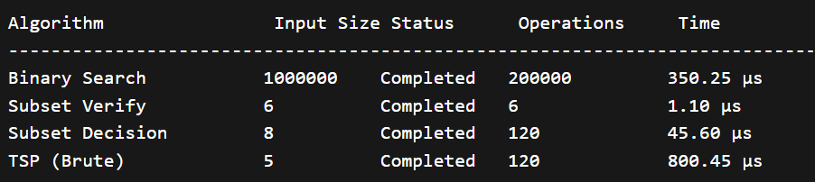

# Step 2: Measure Metrics

## Metrics Used

1. Execution Time  
Measured in microseconds using high resolution clock.

2. Operations Count  
Counts core operations inside loops/recursion.

3. Feasibility Status  
- Completed → Finished within 2 seconds  
- Timeout → Exceeded 2 seconds

---

## Environment

Hardware: 16GB RAM, Intel i5   
Compiler: GCC  

---

## Execution Log
